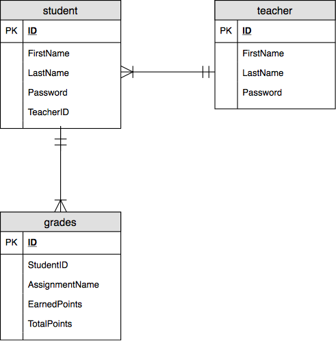

# CS3380 Final Project

Created by Brian Cox and Ryan Wortmann

## Description

For our final project, we decided to create a elementary-school gradebook application that allows teachers to enter grades for their students.  Teachers can add new grades, edit existing grades, or delete existing grades for their students.  Each teacher creates a login for each of their students.  If a teacher logs in, they will be able to see all of their students' grades; if a student logs in, they will be able to see only their grades.

## Schema

Table: teachers

|  #  |  Name       |  Type          |  Null  |  Default  |
|-----|-------------|----------------|--------|-----------|
|  1  |  ID         |  int           |  No    |  None     |
|  2  |  FirstName  |  varchar(50)   |  No    |  None     |
|  3  |  LastName   |  varchar(50)   |  No    |  None     |
|  4  |  Password   |  varchar(255)  |  No    |  None     |

Table: students

|  #  |  Name       |  Type          |  Null  |  Default  |
|-----|-------------|----------------|--------|-----------|
|  1  |  ID         |  int           |  No    |  None     |
|  2  |  FirstName  |  varchar(50)   |  No    |  None     |
|  3  |  LastName   |  varchar(50)   |  No    |  None     |
|  4  |  Password   |  varchar(255)  |  No    |  None     |
|  5  |  TeacherID  |  int           |  No    |  None     |

Table: grades

|  #  |  Name            |  Type         |  Null  |  Default  |
|-----|------------------|---------------|--------|-----------|
|  1  |  ID              |  int          |  No    |  None     |
|  2  |  StudentID       |  int          |  No    |  None     |
|  3  |  AssignmentName  |  varchar(50)  |  No    |  None     |
|  4  |  EarnedPoints    |  int          |  No    |  None     |
|  5  |  TotalPoints     |  int          |  No    |  None     |

## ERD Diagram

## CRUD

Create:

- Create students
- Create grades

Read:

- Read grades
- Read teachers
- Read students

Update:

- Update grades

Delete:

- Delete grades

## Demo
